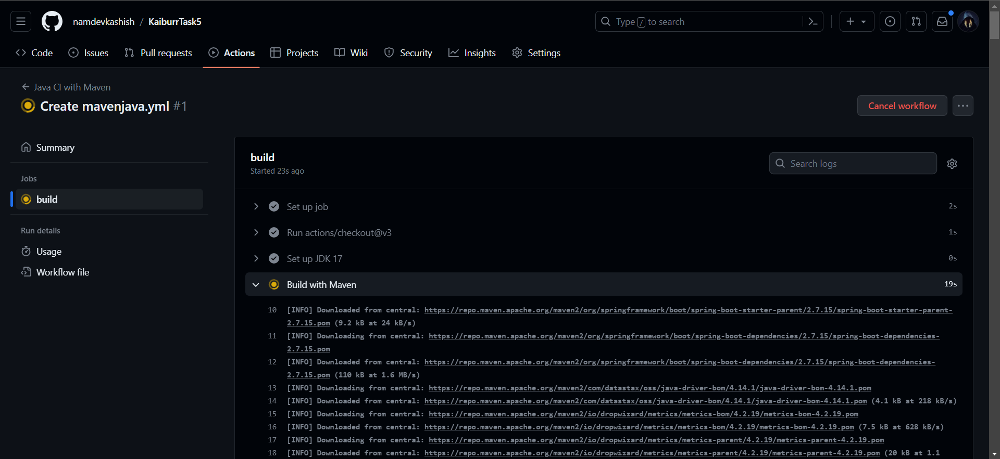
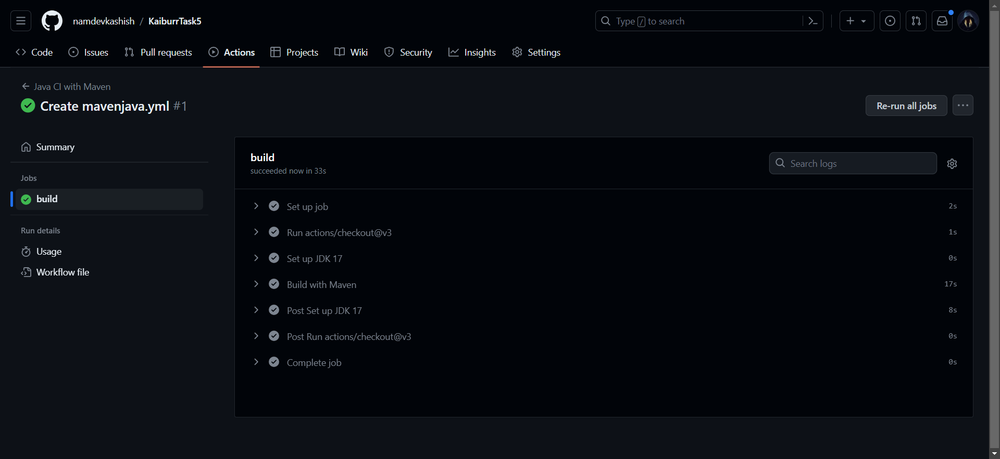
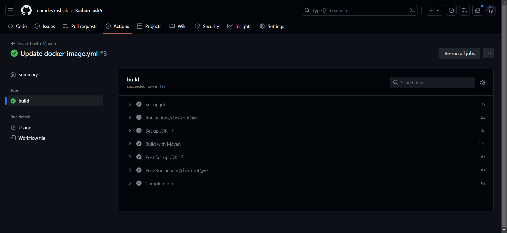

# Java REST API CI/CD Pipeline

This repository demonstrates the setup of a CI/CD pipeline for a Java REST API application. The application allows users to manage server objects, with various endpoints for CRUD operations. The CI/CD pipeline automates building, testing, and deploying the application using GitHub Actions and Docker.

## Application Overview

This Java REST API application provides the following endpoints:

- **GET /servers**: Returns a list of all servers if no parameters are passed. When a server ID is provided as a parameter, it returns a single server or a 404 error if the server doesn't exist.

- **PUT /servers**: Adds a new server. The server object is passed as a JSON-encoded message body.

- **DELETE /servers/{id}**: Deletes a server based on the provided server ID.

- **GET /servers/find/{name}**: Searches for servers by name. It returns one or more servers whose names contain the specified string or a 404 error if no matches are found.

The "server" objects are stored in a MongoDB database.

## CI/CD Pipeline Overview

This repository is configured with a CI/CD pipeline using GitHub Actions. The pipeline consists of the following steps:

1. **Build and Test**: The application is built and tested using Gradle. If the tests pass, the build continues.

2. **Docker Image Build**: A Docker image is created using a Dockerfile provided in the repository. This image includes the Java application.

3. **Push to Docker Hub**: The Docker image is pushed to a Docker Hub repository. Docker Hub credentials are securely stored as secrets in the GitHub repository.

4. **Deployment**: After pushing the image, the deployment step connects to the target server, pulls the latest Docker image, and restarts the Docker container to update the application.

## How to Use Postman

To interact with the REST API and test the endpoints, you can use Postman or any other HTTP client. Here's how to use Postman:

1. Open Postman and create a new collection for your API requests.

2. Add requests for various endpoints (GET, PUT, DELETE, GET by name) with the necessary parameters and JSON payloads.

3. Run the requests and observe the responses. You can check for successful or error responses based on the provided examples.

## Screenshots

### Building and Testing

### Docker Image Build

### Deployment

## Additional Notes

- Ensure that your MongoDB database is properly configured and accessible by the application.
- This is a simplified example, and in a production environment, you may need additional security and scaling considerations.
